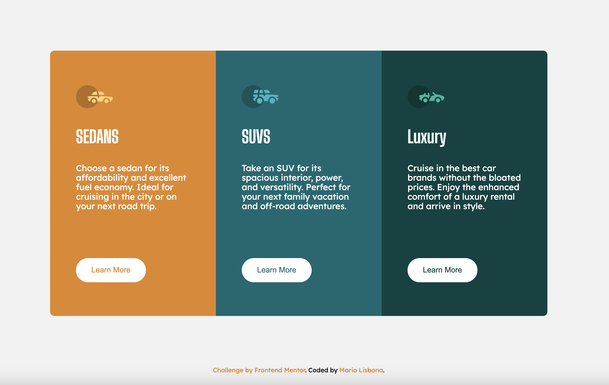
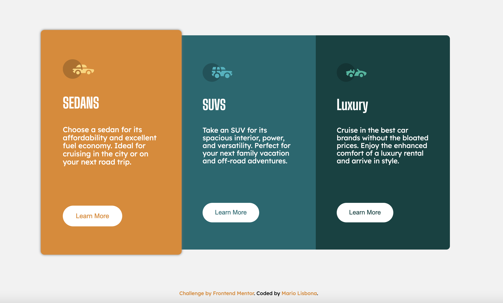
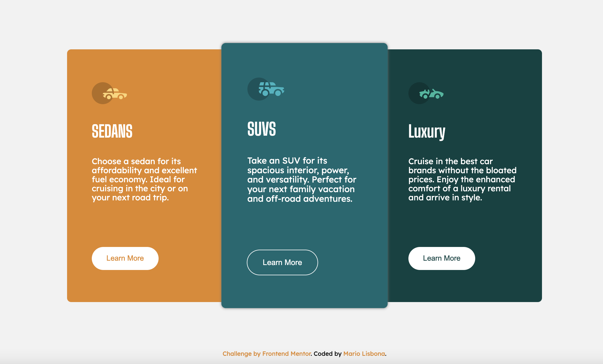
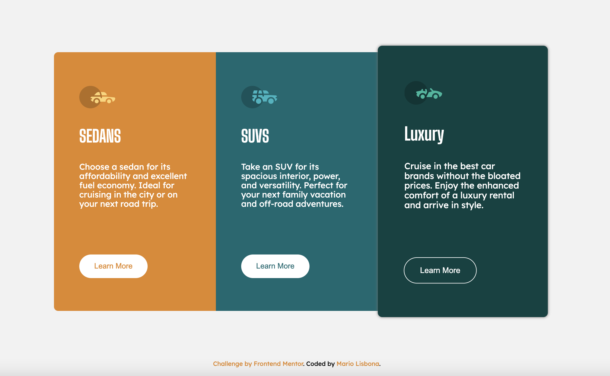

# Frontend Mentor - 3-column preview card component solution

This is a solution to the [3-column preview card component challenge on Frontend Mentor](https://www.frontendmentor.io/challenges/3column-preview-card-component-pH92eAR2-). Frontend Mentor challenges help you improve your coding skills by building realistic projects. 

## Table of contents

- [Overview](#overview)
  - [The challenge](#the-challenge)
  - [Screenshot](#screenshot)
  - [Links](#links)
- [My process](#my-process)
  - [Built with](#built-with)
  - [What I learned](#what-i-learned)
  - [Continued development](#continued-development)
- [Author](#author)

**Note: Delete this note and update the table of contents based on what sections you keep.**

## Overview

### The challenge

Users should be able to:

- View the optimal layout depending on their device's screen size
- See hover states for interactive elements

### Screenshot

### Links

- Solution URL: [Add solution URL here](https://github.com/MarioLisbona/FEM-3-column-preview-card)
- Live Site URL: [Add live site URL here](https://mariolisbona.github.io/FEM-3-column-preview-card/)

## My process

First i setup the main container with flex-box and centered all its content. I then created the base class for the car card. I added 3 styles SUV, lux and sedan to add to this base class to style the individual cards.
I used :first-child and :nth-child(3) to styles the first and last cards with border radius and animations. :last-child would not work.

I set the max-width using rem and let the height of the container fill out with the margin's of its child elements. This way the max width is set and it will shrink with the smaller screen size.
This was a tip from @vanzasetia

I set the main container to flex-direction: column for anything under 800px.This means the cards will stack on top of each other and also change any associated border radius and animations.

### Built with

- Semantic HTML5 markup
- CSS custom properties
- Flexbox

### What I learned

I learned to style the width of the container using max-width and rem units instead of vw which i was using before. I also learned to use margin's on the elements to style the height of the container.

### Continued development

I will continue to use this method to style the height and width of containers

## Author

- Frontend Mentor - [@MarioLisbona](https://www.frontendmentor.io/profile/MarioLisbona)
